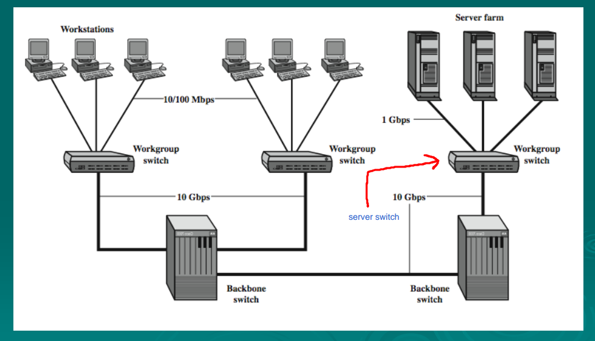

# LAN Design
- Toplogy used : Hierachical Topolgy
- 3 layers:
	-  access layer(edge layer)
	-  Distribution layer (aggregation layer)
	-  Core layer
- 
- these layers are implementation layers not protocol layers
- if the network is for a large organization (having multiple buildings & crucial data) (ex: University, Hospital, Ministry), then the core layer is a obligatory
- otherwise it's optional

# Access Layer (edge layer)
- contains a group of switches called **Access Switches or Edge Switches**
- Access Switches: Switches where end devices connect to, therefore user devices access the network through these switches
- It's called edge switches because they're at the edge of the network, as this switch is the only visible device for the end device
# Distribution layer (aggregation layer)
- each access switch is connected to a distribution switch(aggregation switch)
- aggregate = collect
- distribute traffic to higher switches
- aggregate traffic from lower switches
- distribution switches are larger with better specification than access switches
- which allows access switches connected to the same distribution switch to communicate
- if the organization is a small organization:
	- no need for core layer 
	- distribution switches are used as core switches (called **core distribution switch**)
# Core Layer
- each distribution switch is connected to a core switch
- distribution switches are able to communicate through core switch
- core switches maximum number is 2
- core switch has higher specification than distribution switch
	- core switches are expensive
- can hold the whole traffic of the network
- the use of 2 core switches
	- load balancing
	- redundancy(if one of the core switches has a problem the other one will be redundant to it)
- core layer the layer when I can move from my network to another network

# Old LAN Design
- were called **flat networks**
- one layer containing all switches
- all end devices are connected to this layer
---
# Benefits of Hierarchical Topology 
1. Scalability
	- ability to extend or increase the capacity of the network at any instance of time
	- unachievable in flat networks
	- ex: increasing capacity for a new building with 5 floors in an organization
		-  add a distribution switch for the building
		- add a group of access switches for each floor
		- connect the access switches to distribution switch
		- connect the distribution switch to the core switch
	- ex: a new floor is added to a building
		- add a group of access switches for the floor
		- connect the access switches to the distribution switch
2. Redundancy
	- Redundancy is done through 4 levels:
		1. Redundant **ports** in a switch:
			- Unused ports in a switch
			- 25 % Redundancy is standard = 25% of port capacity unused
			- Might seem as a waste for the owner of the organization
			- Therefore, 20% or 15% redundancy is done
			- Ex: Switch with 24 Port &rarr; 4 ports unused
		2. Redundant **Components** :
			- Ex: Switch was a broken power supply
				- Takes time to be fixed
				- Switch in this time is down, Therefore no traffic is going through or from it
				- Should've used a switch with *Dual Power Supply*
				- if there's a problem in one power supply the other starts working
				- Therefore, avoided the risk of going through down time
			-  It's done with multiple components, ex:
				- Dual CPU
				- Dual HDD
			- May be costly
			
		3. Redundant **Devices**:
			- Redundant Switch
				- case: 10 switches needed in a building, 12 switches bought
					- building divided to 2 Zones
					- each zone has 5 switches & 1 redundant switch
					- if a switch falls down switch it with the redundant switch
				- case: all ports are used in all switches
					- use ports in the redundant swtich
		4. Redundant **Cabling**:
			- Redundant Link
			- Case: if a distribution switch falls for any reason
				- all devices connected to that switch stop working
				- solution: Redundant **Link**
				- cable connected from the devices to the other distribution switch
				- so the devices connected will not stop working if the distribution switch falls
			- 
3. Performance
	- Different Switches are available each with different performance
	- Link Aggregations:
		- Aggregation of the bandwidth to any desired value
		- ability to add more links between switches & aggregating their bandwidth together
		- Appear logically as one link
		- ex: two 100mbps links connected between 2 switches, when aggregated they can provide 200mbps speed
	- Each device provide aggregation up to N mbps based on the type & model of device used
4. Security
	- In Flat Networks:
		- If a switch fails in the network, all other switches fails
		- network can fall from a single attack on a single device
	- In Hierarchical networks:
		- Security Level in each layer
		- Port Security at access level
		- Policies at Distribution level
5. Manageability & Maintainability(اداره و صيانه الشبكه)
	### Maintainability
	- easier in hierarchical networks than flat
	- Flat Networks
		- all switches and all ports are messed up and unorganized
			- therefor it's difficult to manage a specific port
	- Hierarchical networks
		- each device is connected to a specific access switch based on its location
		- ex: devices in building 2, floor 3 are connected to access switch no. 5
		- therefore it's easier to find the port connected to a specific device
	### Manageability
	- any device can be accessed and configured because each device is numbered
---
# Hierarchical network design principles
- Network Diameter
	- Number of switches in the path from one endpoint to another
	- the smaller network diameter, the better
- Aggregate Bandwidth
	- **Bandwidth aggregated to what extent**
- Redundant Components
	- more redundant components &rarr; more cost
	- justify why the use of each redundant component
	- pass through each layer
	- Access Layer
		- redundant ports or not
		- redundant device
			- amount
			- why this amount	
		- redundant components
			- redundant power supply, Processors, HDD
			- which devices have redundant components
			- **Redundant components are not used in access layer**
				- Because there's redundant switches and redundant ports in the access layer
	- Distribution Layer:
		 - we don't used redundant distribution switch
			- bec. it's costly
		- Redundant Components
			-  Fully Redundant components (i.e Redundant Power supply, Redundant Processor, Redundant Hard Drive)
	-  Core Layer:
		- Redundant Core Switch
			- for very large facilities and organizations
		- Fully Redundant Components
			- Justify where are the components & why
	- Links:
		- is there redundant links at every switch?
		- Link type & specifications at every layer
			- access Link specification
			- Distribution link specification
			- Core link specification
---
# Access Switch Features
- Port Security
	- security through each port
- VLANs
	- Virtual Local area network
	- made inside the physical network
	- case: grouping of 200 user without the need for creating a specific physical network for them, virtually they're separated from the rest of the network
- Fast Ethernet / Gigabit Ethernet
- Power Over Ethernet (PoE):
	- each switch has 2 inputs
	- power input & data input
	- ability to provide power & data through 1 input only
- Link Aggregation
- Security at ports

# Distribution Switch Features
- Gigabit Ethernet / 10Gigabit Ethernet / 40Gigabit Ethernet
- Redundant Components
- Security at ports & security polices at switch
- Link aggregation
# Core Switch Features
- 100Gigabit Ethernet
- Redundant Components
- Link aggregations
---
- There's no Standard for LAN Design
- Different Design for each different place

---
# LAN Design Model for a small facility
- Used with
	- Small factory
	- small advocate's office with 2 floors
- No Core Layer
	- To budget the cost
- Access layer & Distribution layer only
- Case: a company with 2 workshops, 20 end devices in each workshop, 2 servers
	- Number of access switches vary according to client (20 end device in our case)
	- ```
		N.B: Access switches can have 24, 48 port
	- 1 Access Switch in each workshop(24 port)
	- 1 distribution switch to connect the 2 access switches
	- 2 servers are connected to the distribution switch
		- in this case the distribution switch should have 4 ports at least
			- 2 ports for access switches
			- 2 ports for servers
- If the client has a large server base:
	- add a server switch connected to the server dedicated distribution switch
	- all servers are connected to the server switch
	- distribution switch for servers is connected to the other distribution switch
	- used to separate the data center
	- a security policy dedicated for servers through multiple levels can be made to ensure servers security
		- Ex: 
			1. a specific user on a specific port can access a single specific server
			2.  can access a specific application on the server and can't access anything else
			3. can access a specific file in the application and other files inaccessible
			4. can access a specific data in the file
	- 

# LAN Design model for a medium facility
- case: a company with multiple departments with very large & very sensitive data, the company network can access other networks in other areas (ex: bank branches)
- banks have multiple departments: like technical department, financial department, HR department, ...etc
- access switches differ based on available end devices (as small facility)
- one server switch & distribution switch for servers
- one distribution switch for access switches connected to end devices
- uses core switches
	- small or medium branch: uses one core switch & use it to connect to the main branch
	- main branch: can use a redundant core with the main core

**Important note for the final**: when creating redundant link:
	- use the main link with a solid line
	- use the redundant link with a stripped line

# LAN Design model for Large facility

- case: University with faculties available in campus & out of campus
- starting from data center
	- DC contains about 20-30 server
	- divide the 20-30 server to 2 groups
	- each group has a server switch
	- servers are connected with the server switches
	- server switches can be connected to each other
	- 
- then insert the core layer of networks
	- 2 cores are used (one is redundant)
	- connected to each other
	- server switch are connected to both core switches
	- in real time, both core switches are used for load balancing
	- 
- connecting to faculties inside campus
	- case: one of the faculties has 5 floors
	- 600 point in the building
	- 120 point average / floor
	- number of access switches = 600/20 = 30 access switch
	- the reason behind 20 is because each switch has 24 access port & 4 ports are redundant
	- 6 access switch / floor
	- 20 device / switch
	- 2 distribution switches in the whole building (one of them is redundancy)
	- distribution switches are connected to core switches in the data center
	-  ` Distribution Switches have fewer ports than access switches`
	-  Distribution switches are modular switches
		- modular switches are switches with modules (خانات)
	- Distribution switches can contain 4 ports at normal
	- a module can be added which extends to 4 more ports and so on based on the number of module slots available
	- 
- connecting to faculties outside campus
	-  case: one of the faculties has 7 building each with 4 floors & each floor has 6 access switches
	- connect access switch to both Distribution switches
	- connect distribution switches to core switch of the building
	- how do we connected the core switch from the building to the data center of the university?
		- we cannot pull a cable from the building to the data center as it's too expensive
		- we connect a router to the core switch
		- Telephone land line is used to connect the router at the building with the routers available at the data center
		- 
- if you want to make a wireless network
	- types:
		- indoor
		- outdoor
	- Indoor WLAN:
		- a number of access points are used inside the building
		- ex: 6 access points at each floor
		- each access point is connected to an access switch as if it is an end device
		- this will increase number of end devices
		- 
	-  Outdoor WLAN:
		- can be done in 2 ways
			1. using poles in the streets (better method, because of better coverage. but costs more due to pole installation cost)
			2. using access point on a hanger on building walls
		- 
- Wireless controller
	- device used for controlling access points
	- connected to core switch
	- 
	- can control all access points connected to the network
		- ex: 
			- power on/off
			- sleep
			- reduce it's maximum power
			-  if it has N antennas, deactivate any number of them
---
# Security
- Threats that can happen if no security precautions present:
	- data stolen & exposed
	- Interruption of operations
	- Damaging the data
	- Modification of data
- prevention of threats:
	- there's no way to prevent 100% of threats
	- security for keeping data safe
	- security for keeping devices safe
	- security for keeping network safe
	- security for keeping technology on the network safe
- Security is the second highest cost in network design after installation
- Good security system consists of multiple levels
- at least one level of security in the network is required
- Firewall behind the router
	- any data going through the router is analyzed and can be removed
	- any data going out of the router is analyzed and can be removed
- Not sufficient enough but can prevent a fair amount of threats
